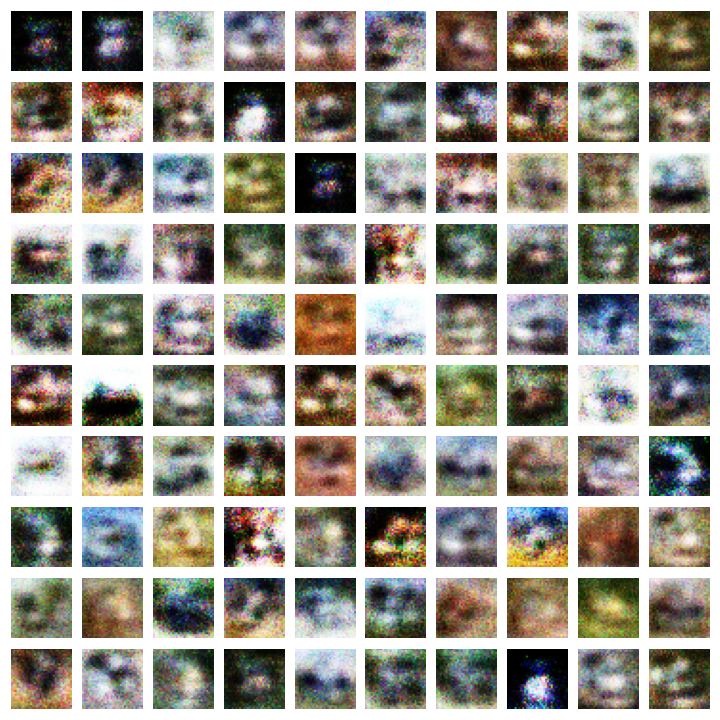

# Generative Adversarial Networks
[[Paper]](https://arxiv.org/abs/1406.2661)


## Output
Visualisations of samples from the generative model




# Usage

```
$ pip install -r requirements.txt
$ python src/train_CIFAR10.py
```

The training scripts accept the following configuration parameters:
```
optional arguments:
  --batch_size		input batch size for training, default 128
  --epochs		number of epochs to train, default 20
  --noise_size		size of the input noise vector, default 64
  --lr_generator        learning rate for the generator, default 3e-4
  --lr_discriminator    learning rate for the discriminator, default 3e-4
```

The trained model and visualizations of the samples from the generator will be saved to `models/` and to `outputs/`
