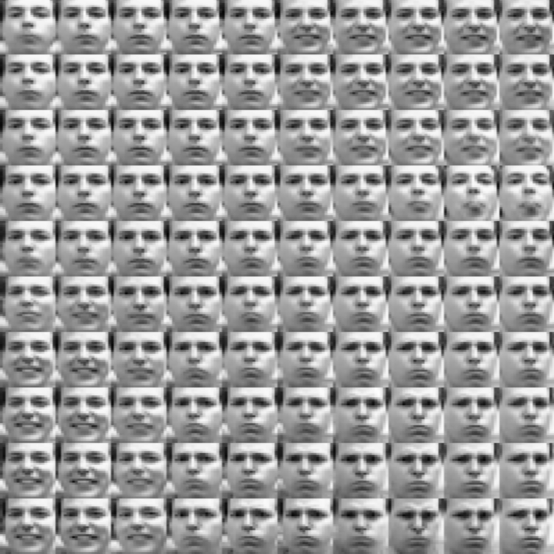
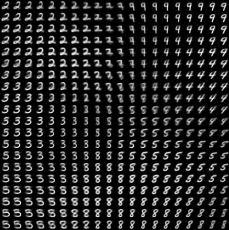

# Auto-Encoding Variational Bayes
[[Paper]](https://arxiv.org/abs/1312.6114)


## Output
Visualisations of the learned manifold for generative models with two-dimensional latent variables





# Usage

```
$ pip install -r requirements.txt
$ python src/train_frey_face.py
$ python src/train_mnist.py
```

The training scripts accept the following configuration parameters:
```
optional arguments:
  --batch_size		input batch size for training
  --epochs		number of epochs to train
  --hidden_size		number of neurons in hidden layers
  --latent_size         number of dimensions for latent variables
  --lr                  learning rate
```

The trained models and visualizations of the learned manifolds will be saved to `models/` `and outputs/`
